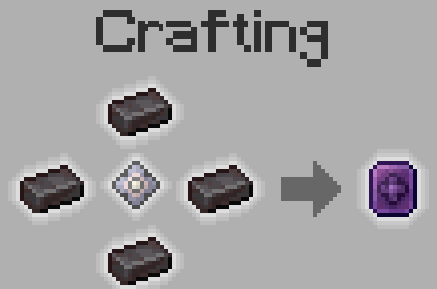
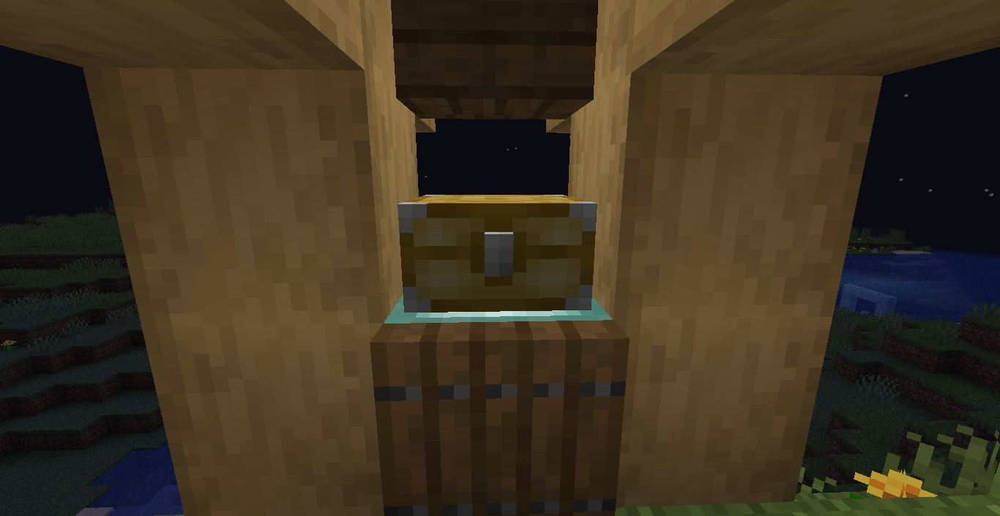
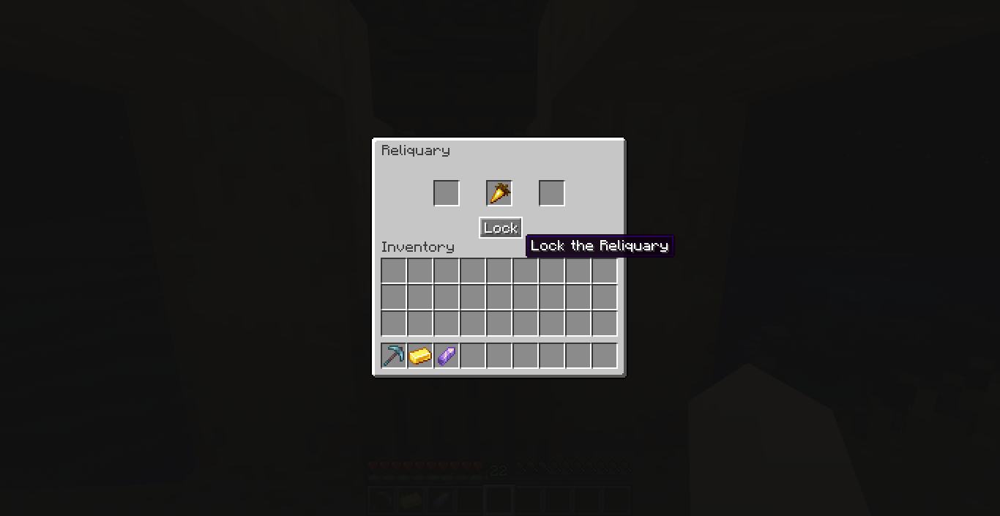
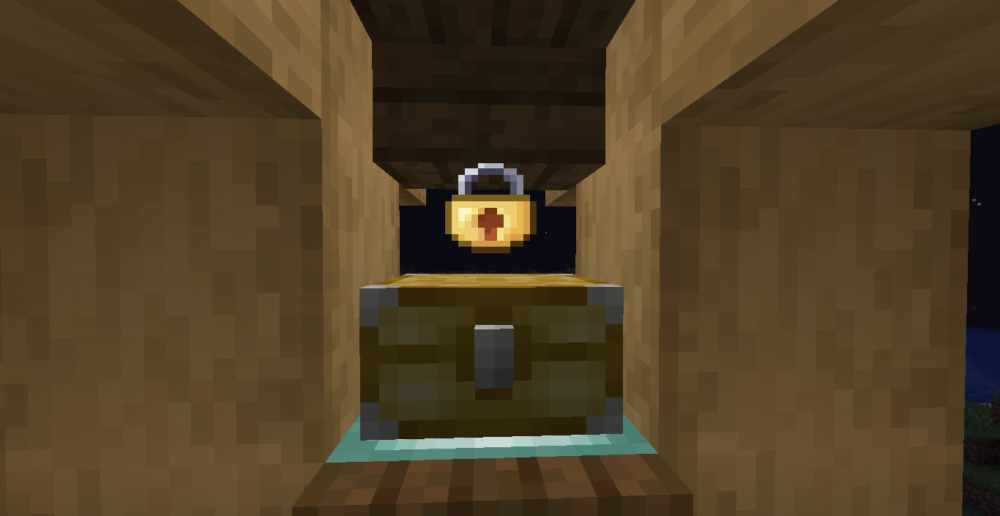

The old legends echo again in the world. It's time to remember the greatest in history.
Explore the stories that time has forgotten, discover secrets that have been buried and face new (or old?) challenges.

# Freatures:

- Very customizable.
- Add 7 new items.
- Add 1 new Structure for explore and loot.
- Add 1 new Enchantment
- Add 3 new unique items:
    - **Emerald Mourning**: A powerful sword imbued with the power of death and revenge. Has 2 passive abilities and 1
      active ability.
    - **Swallows Storm**: An electrifying shield that devours lightning like cookies. Has 3 passive abilities and 1
      active ability.
    - **Flutter Echo**: A spike capable of altering the threads of time. Has 2 passive abilities and 1 active ability.
- Add 3 new mechanics:
    - Unique mechanic of old legends items: **Awake**.
    - Reliquary: Offer sparkly items to Grinning Hoarder and receive a recompense for this.
    - Rune Table: Used for crafting of runes and new enchantments.

## Awake

Restore old legends and unleash their true power. For this, you need new 2 items: Pale Gem and End Extract.

- **Pale Gem**: You can dig up it with a Brush at archaeological sites.
- **End Extract**: You can get this every time you defeat the Ender Dragon.

With 1 Pale Gem and 4 Netherite Ingots, you craft the **Awakening Upgrade**

Then put the Old Legend Item, Awakening Upgrade and End Extract in the Smithing Table.

Congratulations! You have revived an old legend

## Reliquary

The reliquary is a container block like a chest but only has 3 slot.

You only can put sparkly items inside this. When the night comes and you lock the reliquary (00:00) the Grinning
Hoarders take them and recompense you for these treasures.

Each sparkly item has a different value, and you can see that in the wiki o you can discover your self. To each slot
exits a multiplier what applied to the item.

And remember once upon lock the reliquary not can be opened again.

For craft the reliquary you need the Reliquary Blueprint what you can obtain with vanilla archeology or find in Ancients
City or Strongholds.

## FAQ

**How use the active abilities?**
If item is in your Main Hand, press Z. If is in your Off Hand, press X. Of course, you can change this.

**I can use this mod in my modpack?**
Yes, of course.

# Languages:

- English: en_us
- Español: es_ar

# Future Plans

- Add more singular items:
    - ~~Emerald Mourning~~
    - ~~Swallows Storm~~
    - ~~Flutter Echo~~ (Previously known as Boomerang Pickaxe)
    - Dual Swords
    - Midas
    - Storm Caller
    - ...
- Improve the aesthetic section (Models, textures, particles, sounds...)
- Add lore for each feature:
    - Emerald Mourning
    - Swallows Storm
    - Flutter Echo
    - Reliquary
- Questline of special missions for each item.