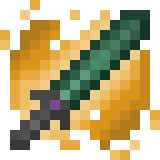

The old legends echo again in the world. It's time to remember the greatest in history.
This is my first public mod. Any help or suggestions is well received.

# Freatures:
- Very customizable. 
- Add 3 new items.
- Add 2 new weapons:
  - **Emerald Mourning**: Is a powerful sword with 2 passive abilities and 1 active ability.
  - **Swallows Storm**: A mystic shield with 3 passive abilities and 1 active ability.
- Unique mechanic of old legends items: **Awake**. 

## Awake
Restore old legends and unleash their true power. For this, you need new 2 items: Pale Gem and  End Extract.
- **Pale Gem**: You can dig up it with a Brush at archaeological sites.
- **End Extract**: You can get this every time you defeat the Ender Dragon.

With 1 Pale Gem and 4 Netherite Ingots, you craft the **Awakening Upgrade**

Then put the Old Legend Item, Awakening Upgrade and End Extract in the Smithing Table.

Congratulations! You have revived an old legend

# Languages:
- English: en_us
- Español: es_ar

# Future Plans
- Add more singular items:
  - ~~Emerald Mourning~~
  - Swallows Storm
  - Dual Swrods
  - Boomerang Pickaxe
  - ...
- Improve the visual section.
- Add lore for each item:
  - Emerald Mourning
  - Swallows Storm
- Questline of special misions for each item.

# Changelogs
## 1.0.0
  - First Release
## 2.0.0
  - Added Swallows Storm
  - Old Legends weapons now are fireproof
  - EmeraldMourning has +1 Damage
  - Changes in how active ability works. Now uses Keybinding, per default is 'Z' for Main Hand and 'X' for Off Hand.
  - Lyfecicle changes